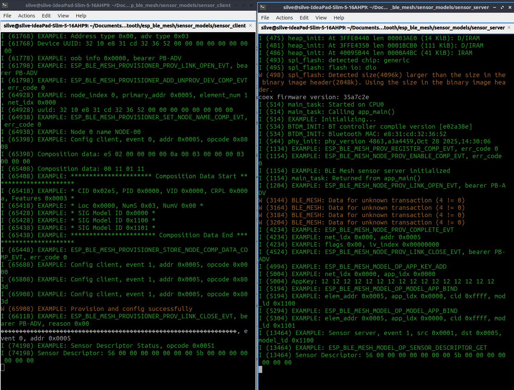
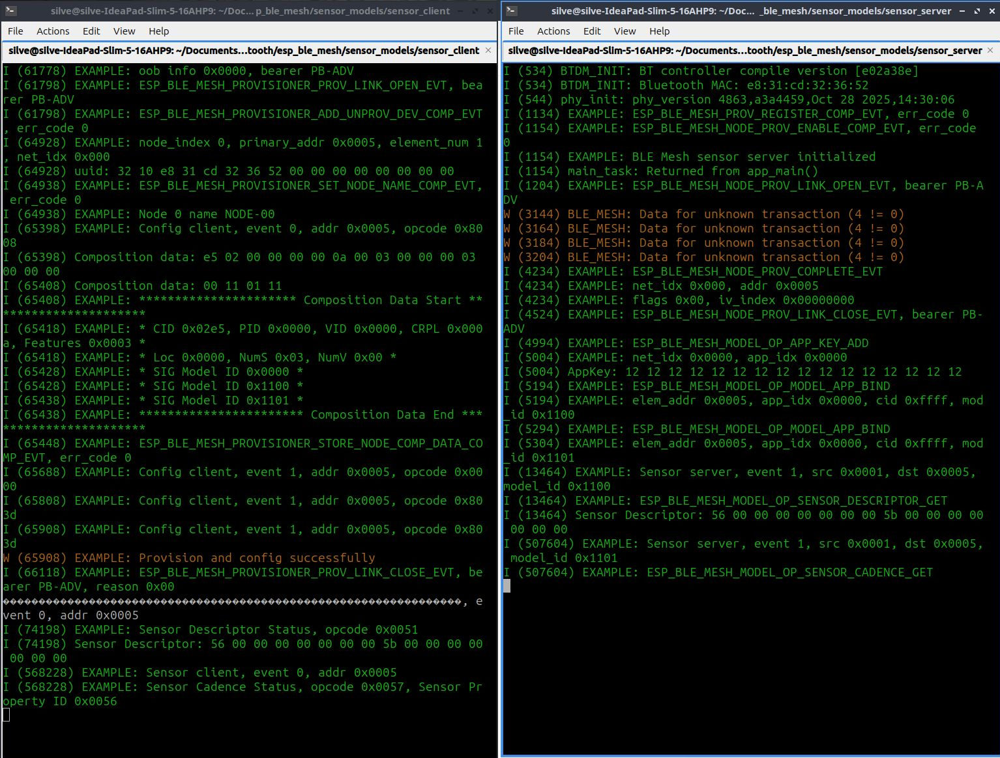
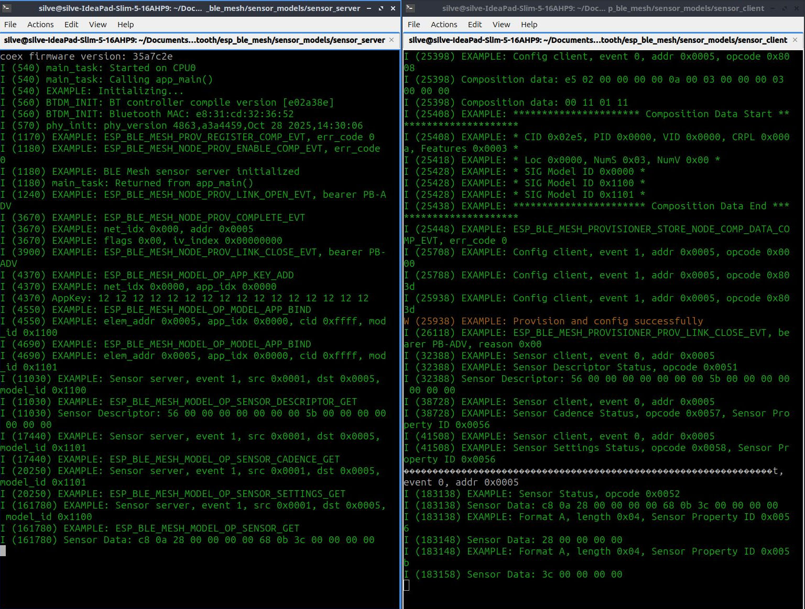
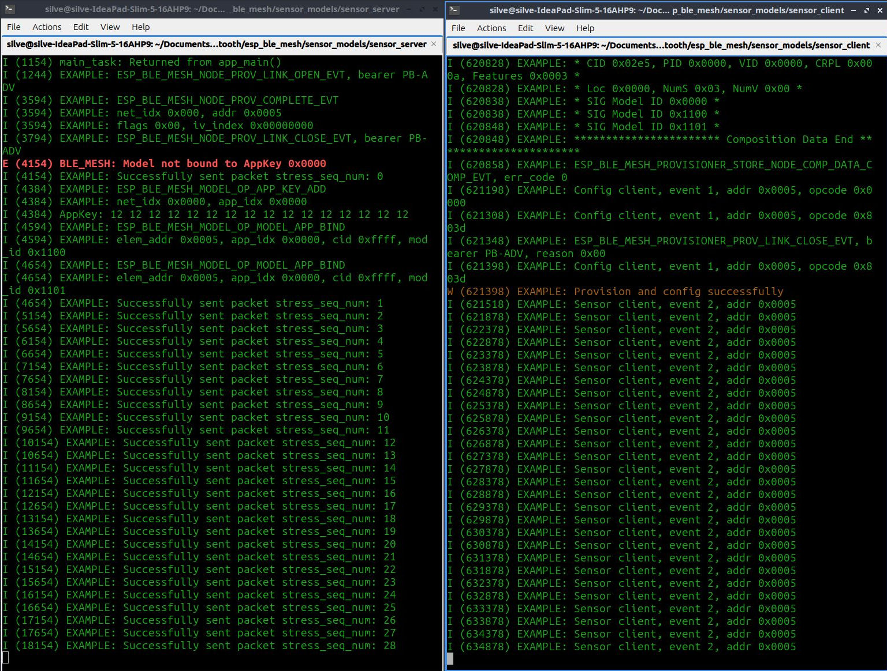
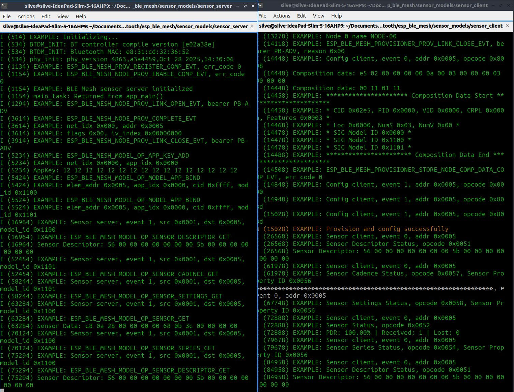
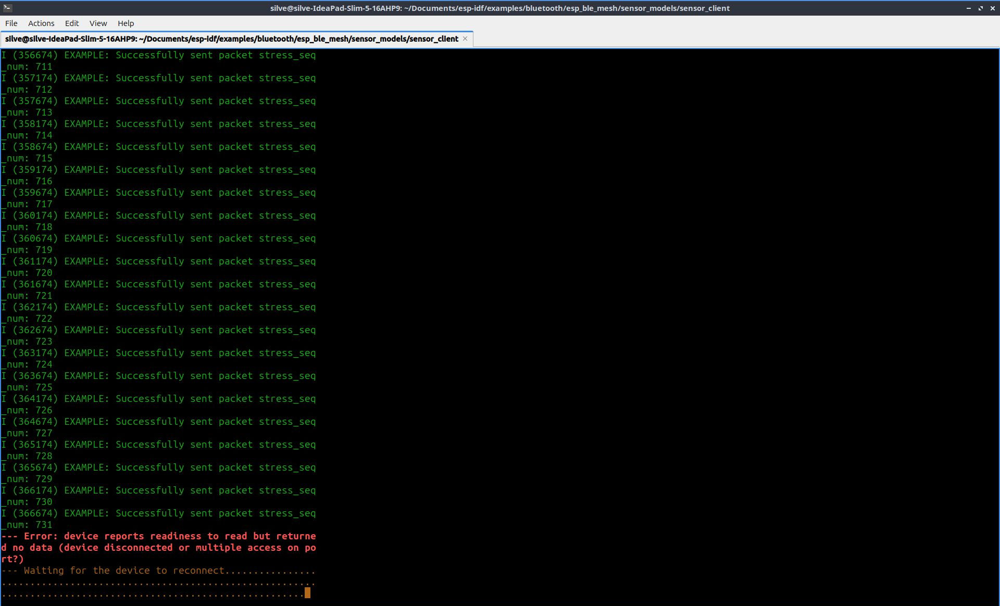

# **PART 1: THEORETICAL FOUNDATIONS AND PROTOCOL ARCHITECTURE OF BLE MESH NETWORKS**

**Course:** Computer Communication Networks  
**University:** Tongji University  
**Document:** Section 1 — Theoretical Background and Network Models  

---

## **1.1 The Routing Paradigm: From Link-State to Managed Flooding**

In classical Wireless Sensor Network (WSN) architectures, the network layer relies on proactive routing protocols (e.g. OSPF, *Link-State* based) or reactive ones (e.g. AODV, *Distance-Vector* based). These algorithms require the continuous transmission of control packets in order to build and keep topological routing tables up to date. In dense IoT environments with limited energy and computational resources, the overhead generated by maintaining network state drastically reduces application *goodput* and increases power consumption.

**Bluetooth Mesh (SIG Standard)** sets aside the notion of directional routing altogether and introduces the **Managed Flooding** paradigm. In this *connectionless* architecture there is no concept of an "optimal path" or a pre-computed "next-hop". When a source node produces data, it broadcasts (floods) it over the air. Every neighbouring device configured with the *Relay Feature* receives the packet and, in turn, re-broadcasts it.

To prevent network collapse caused by *broadcast storms* (endless retransmission cascades), Managed Flooding implements two rigorous mitigation mechanisms:

1. **Network Message Cache:** Each Relay node allocates a data structure in RAM (generally a circular buffer managed with LRU — *Least Recently Used* — logic) that maps the signatures of recently processed packets. The signature is computed from the source address (*SRC Address*) and the Sequence Number (SEQ). Before starting the cryptographic operations required for forwarding, the Network Layer compares the incoming packet's $(SRC, SEQ)$ tuple against the cache. On a hit, the packet is dropped at the MAC layer, eliminating geometric redundancy in real time ($O(1)$ lookup time).

2. **Time-to-Live (TTL) and Hop Limit:**
   The TTL is a 7-bit field in the Network Layer header. It defines the spatial propagation radius of the packet. The source node initialises the TTL to a value $N$ (e.g. $TTL = 5$). At every radio hop, the Relay node performs $TTL = TTL - 1$. When a packet arrives with $TTL \le 1$, the network layer inhibits the forwarding function. This guarantees that the packet's reach decays mathematically as a function of the depth of the topological tree.

## **1.2 The BLE Mesh Protocol Stack: ISO/OSI Decoupling**

The BLE Mesh framework does not replace classic Bluetooth Low Energy; it is grafted on top of its physical (PHY) and MAC layers, extending the stack towards the application layers through a highly specialised seven-layer hierarchy:

* **Physical Layer (PHY):** Uses GFSK (Gaussian Frequency Shift Keying) modulation in the 2.4 GHz ISM band, with a gross bit rate of 1 Mbps (BLE 4.x) or 2 Mbps (BLE 5.x).
* **Link Layer:** Handles the syntax of *Advertising* packets. In Mesh, only the three primary advertising channels (37, 38 and 39) are used, maximising the probability of omnidirectional reception without requiring clock synchronisation (frequency hopping).
* **Bearer Layer:** Abstracts the underlying transport medium. It uses the *Advertising Bearer* for native Mesh communication, or the *GATT Bearer* to retain backward compatibility with non-Mesh devices (e.g. smartphones).
* **Network Layer:** The core of routing. It applies addressing (16-bit Unicast, Group or Virtual address), performs decryption with the **NetKey** and validates the structural integrity of the packet through the Network Message Integrity Check (NetMIC). If the NetMIC fails, the packet is considered hostile and dropped.
* **Lower Transport Layer:** Introduces **Segmentation and Reassembly (SAR)** logic. Since the usable payload of a single BLE advertising packet is limited to 31 bytes (and only 11–15 bytes for Mesh data once headers are included), this layer fragments larger application packets and manages transport-level acknowledgements (ACK).
* **Upper Transport Layer:** Performs the second, end-to-end layer of decryption using the **AppKey**. It authenticates application data through the Application MIC (AppMIC).
* **Access Layer & Foundation Models:** Defines data semantics (Client/Server) and the Publish/Subscribe architecture. The *Foundation Models* manage network state (e.g. Configuration Server) for diagnostics and key assignment.

## **1.3 MAC Analysis: CSMA/CA and Collision Models in the 2.4 GHz Domain**

In the absence of a central network controller dynamically allocating transmission time slots (TDMA), access to the transmission medium relies on the stochastic **CSMA/CA (Carrier Sense Multiple Access with Collision Avoidance)** protocol.

### **1.3.1 Clear Channel Assessment (CCA) and Backoff**
Before occupying channels 37, 38 or 39, the radio interface passively monitors the band (CCA) by measuring RSSI. If the detected energy is below a defined threshold, the channel is considered free (*Idle*) and the PDU is transmitted.
If the channel is busy (*Busy*), the node defers transmission by a random interval $T_{backoff}$ before running CCA again, mitigating synchronised collisions.

### **1.3.2 Collision Probability and Overhead**
As node density $\lambda$ and publication frequency $f_{tx}$ grow, the collision probability $P_{coll}$ increases exponentially. Assuming a Poisson packet arrival model, the probability that a transmission succeeds on a shared channel can be approximated by the unslotted ALOHA model:
$$P_{success} = e^{-2G}$$
where $G$ is the normalised offered traffic.
BLE Mesh overhead compounds this physical limit. The need to carry NetMIC, AppMIC, Sequence Number and headers reduces spectral efficiency. As a result, the real throughput of a dense indoor Mesh network is a tiny fraction of the 1 Mbps physical bit rate, requiring careful architectural tuning of packet rate and Relay node placement.

## **1.4 Architectural Security and Two-Tier Cryptographic Isolation**

Security is not optional in the SIG Mesh protocol; it is structurally integrated to resist *Eavesdropping*, *Man-in-the-Middle (MitM)*, *Replay* and *Trash-can* attacks.

### **1.4.1 OOB Provisioning and ECDH**
Admitting a new node (Unprovisioned Device) into the network requires a complex handshake. Cryptographic material is exchanged through asymmetric elliptic-curve keys using **ECDH (Elliptic Curve Diffie-Hellman)** on the P-256 curve. The resulting shared secret makes it possible to encrypt the session and transfer the NetKey without ever transmitting it in clear over the air.

### **1.4.2 Key Separation (NetKey vs AppKey)**
The framework adopts a two-tier security paradigm based on the 128-bit symmetric **AES-CCM** algorithm, guaranteeing isolation between the routing infrastructure and sensitive data:
* **NetKey (Network Key):** Known to *all* authorised nodes (Relays included). It is used exclusively to obfuscate SRC/DST addresses and validate the NetMIC. It allows a Relay node to forward a packet without being able to read its application content.
* **AppKey (Application Key):** Known *only* to the nodes that must process that data domain (e.g. only the temperature sensors and the central gateway Client). This key encrypts the application *payload*. A Relay node decrypts the network envelope with the NetKey in order to forward the packet, but — lacking the AppKey — cannot extract the sensor data inside.

To prevent *Replay Attacks* (in which an attacker records a valid packet and retransmits it days later), the cryptographic layer folds the Sequence Number directly into the computation of the *nonce* (Number Used Once) fed to the AES-CCM engine, guaranteeing absolute temporal uniqueness for every single PDU transmitted in the lifetime of the network.


# **PART 2: SYSTEM ARCHITECTURE AND EXPERIMENTAL TOPOLOGY**

**Course:** Computer Communication Networks

**University:** Tongji University

**Document:** Section 2 — Hardware Analysis, Network Topology and FreeRTOS Concurrency

---

## **2.1 Hardware Characterisation: The ESP32 System-on-Chip**

Empirical validation of the BLE Mesh protocol requires a computing platform able to handle radio-stack timing and application code execution simultaneously. The system was engineered entirely on the **Espressif ESP32** System-on-Chip (SoC), a high-performance microcontroller designed specifically for IoT and wireless networking applications.

### **2.1.1 Internal Architecture and Radio Subsystem**

The ESP32 is equipped with an **Xtensa Dual-Core 32-bit LX6** microprocessor running at 240 MHz and capable of delivering up to 600 DMIPS. This asymmetric architecture is fundamental to wireless networking: it allows hardware isolation of critical processes, dedicating one core to the low-level radio controller code (Bluetooth Link Layer) and the other to high-level functions (Access Layer and application logic).

The integrated transceiver operates in the shared 2.4 GHz ISM band. The RF front-end internally includes:

* An integrated balun, power amplifiers ($Tx$), low-noise amplifiers ($Rx$) and tuning filters.
* Dynamic transmit power management through `esp_ble_tx_power_set()`, configurable from $-12 \text{ dBm}$ to $+9 \text{ dBm}$. This granularity makes it possible to artificially shrink antenna coverage in order to induce short-range multi-hop behaviour in the lab.

### **2.1.2 Power Management and Supply Bus Stability ($V_{cc}$)**

Bringing up the RF sections of all three microcontrollers at once produces impulsive current draws of $130 \text{ mA} \sim 240 \text{ mA}$ during transmission (*Tx Burst*). Powering the devices simultaneously from a shared linear USB hub introduces mutual interference on the bus and voltage drops (*brownout*), which in turn corrupt the Bluetooth controller's memory registers.

To guarantee stability and spectral purity of the transmissions, the infrastructure was electrically isolated by powering each development board from a separate, continuous source (dedicated low-output-impedance power banks), stabilising the $5 \text{ V}$ input to the on-board linear regulator (LDO) that feeds the chip at $3.3 \text{ V}$.

---

## **2.2 Multi-Hop Network Topology and Addressing Plan**

The experiment maps a linear indoor multi-hop Mesh topology in order to analyse the impact of intermediate nodes on transmission metrics. The logical configuration places source node and collector node out of direct radio line of sight, making the Relay module indispensable.

### **2.2.1 Unicast Address Allocation and Group Logic**

The network addressing plan, orchestrated by the Provisioner while configuring the Foundation Models, assigns unique static 16-bit addresses according to the following logical hierarchy:

* **0x0001 — Sensor Client (Provisioner/Gateway):** Root element of the network. It subscribes to the group address and acts as the sink collecting the telemetry vectors.
* **0x0005 — Sensor Server (Edge Node):** Peripheral element physically attached to the data generation subsystem. It is configured to publish the application payload asynchronously.
* **0x0006 — Relay Node (Infrastructure):** Intermediate element placed within the common coverage radius of `0x0005` and `0x0001`. Its publication function is disabled, so it operates exclusively at the Network Layer.

Application communication uses group addressing, with a dedicated **Group Address** set to `0xC001`. The Sensor Server (`0x0005`) publishes data to `0xC001`, while the Sensor Client (`0x0001`) configures its reception filters by subscribing to the same `0xC001` address. The Relay node, operating purely at network level through the shared NetKey, propagates packets addressed to `0xC001` without needing to be configured explicitly as an application-level recipient.

---

## **2.3 Deterministic Scheduling and Concurrency with FreeRTOS**

To avoid timing drift in packet transmission (fixed at a critical $100 \text{ ms}$ interval in the stress-test scenario), firmware execution is governed entirely by the **FreeRTOS** real-time operating system integrated into the ESP-IDF core.

### **2.3.1 Task-to-Core Assignment (CPU Affinity)**

The code architecture uses the `xTaskCreatePinnedToCore` API to bind thread execution to distinct physical cores, eliminating inter-core context-switch overhead and protecting the radio's deterministic processes:

1. **Protocol Stack Task (Core 0):** The Espressif Bluetooth stack (Bluedroid and the BLE Mesh controller) runs on Core 0. It manages the radio interrupt hardware queues, the AES-CCM cryptographic computations tied to packet validation, and dynamic updates to the Network Message Cache.
2. **Application & Telemetry Task (Core 1):** The application task — lower priority than the radio stack, but configured as a deterministic blocking thread — runs on Core 1. It handles periodic telemetry wake-ups via a FreeRTOS *Software Timer*, guaranteeing that payload formatting never steals machine cycles from Core 0's real-time radio event handling.

### **2.3.2 Thread-Safe Data Exchange and Non-Blocking API Calls**

Interaction between Core 1's application logic and Core 0's protocol stack follows an *Event-Driven Architecture*. The telemetry task fills a local memory buffer with the synthetic sensor data vector and calls the stack's non-blocking API function:

```c
esp_err_t err = esp_ble_mesh_model_publish(sensor_server_model, &publish_param);

```

This implementation imposes the following engineering constraints:

* **No blocking loops:** Inside the BLE Mesh callback functions (`esp_ble_mesh_sensor_server_cb_t`), waiting primitives such as `vTaskDelay()` or `while(1)` loops are structurally forbidden. Blocking in this section would freeze the Core 0 task, causing immediate loss of Link Layer synchronisation and systematic dropping of concurrent packets on the air.
* **Sequence counter integrity:** The Application Sequence Number (`stress_seq_num`) is incremented inside the atomic instance of the telemetry task on Core 1 before publication, guaranteeing the mathematical consistency of the PDR metric read by the receiving gateway.


# **PART 3: FIRMWARE IMPLEMENTATION, STATE MACHINE AND EVENT-DRIVEN ARCHITECTURE**

**Course:** Computer Communication Networks

**University:** Tongji University

**Document:** Section 3 — Provisioning Flow, Model Configuration and Callback Logic

---

## **3.1 The Asynchronous Provisioning State Machine and Security Layer**

Admitting an unconfigured device (*Unprovisioned Device*) into the cryptographic domain of the Mesh network is governed by an asynchronous finite state machine managed by the *Provisioner* module (Node 1). The firmware implementation in `main.c` maps this sequence through activation of the primary network bearer (`PB-ADV`), which carries configuration PDUs over BLE advertising packets, avoiding the overhead of GATT connection channels.

The logical flow follows these sequential macro-phases:

1. **Beaconing and Invitation (`Provisioning Invite`):** On boot, the peripheral nodes (Sensor Server and Relay) initialise the radio stack and cyclically emit *Unprovisioned Beacon* packets carrying their 128-bit Device UUID. The Client intercepts these beacons through active scanning and sends a `Provisioning Invite` PDU. The nodes respond by advertising their structural `Capabilities` (number of hardware elements, supported cryptographic algorithms and any Input/Output interfaces).
2. **Public Key Exchange (`ECDH Key Exchange`):** To prevent passive interception (*Eavesdropping*), the two parties run the asymmetric **ECDH (Elliptic Curve Diffie-Hellman)** key exchange algorithm on the standardised *FIPS P-256* elliptic curve. The Provisioner and the joining node independently compute the shared secret from their own private keys and the public keys exchanged over the air. This asymmetric secret never travels on the radio channel, establishing a temporary, highly secure encrypted symmetric channel.
3. **Authentication:** For lab testing and faster deployment, the handshake uses **Just Works** mode. The authentication layer assumes no logical or physical Out-of-Band (OOB) channel, completing mutual node validation without requiring control strings.
4. **Network Data Distribution (`Provisioning Data Distribution`):** Once the link is validated, the Client encrypts the global provisioning data with the ECDH-derived session key and distributes it to the nodes. This block includes:
* The global 128-bit **NetKey (Network Key)**.
* The network's current *IV Index* for temporal synchronisation.
* A unique 16-bit **Unicast Address**, assigned incrementally by the Provisioner (e.g. `0x0005` for the Sensor Server, `0x0006` for the Relay).




*Fig. 1 - UART log transition during the ECDH cryptographic handshake and assignment of Unicast address 0x0005 to the Sensor Server node.*

---

## **3.2 Publish/Subscribe Topology Initialisation and Model Configuration**

Immediately after the provisioning link closes, the nodes are official members of the network at Network Layer level, but do not yet hold the authorisation to exchange application payloads. The firmware therefore transitions into the **Model Configuration** phase, orchestrated by Node 1's *Configuration Client*.

### **3.2.1 Composition Data Structure (`esp_ble_mesh_comp_t`)**

In the Sensor Server source file, the hardware is mapped structurally by defining element geometry. Every node owns at least one *Primary Element*. Inside the primary element's memory module, the foundation and application models are initialised:

```c
static esp_ble_mesh_model_t root_models[] = {
    ESP_BLE_MESH_MODEL_CFG_SRV(&config_server),
    ESP_BLE_MESH_MODEL_SENSOR_SRV(&sensor_server_pub, &sensor_server_data)
};

```

The `ESP_BLE_MESH_MODEL_SENSOR_SRV` macro loads the **Sensor Server Model** instance defined by the Bluetooth SIG, binding the publication parameter structures (`sensor_server_pub`) and the sensor data operating context (`sensor_server_data`).

### **3.2.2 AppKey Binding and Group Address Subscription**

The Configuration Client atomically issues the following wireless RPC calls to complete the logical architecture:

1. **Config AppKey Add:** The Client sends the 128-bit **AppKey (Application Key)** specific to the sensor domain, encrypting it with the NetKey.
2. **Model App Bind:** Binds the newly distributed AppKey to the `ESP_BLE_MESH_MODEL_SENSOR_SRV` model on the Server and to the corresponding Client model on the Gateway. This isolates telemetry data, preventing nodes belonging to other domains (e.g. lighting) from decrypting the payload.
3. **Model Publication / Subscription Set:** Configures the logical routing parameters. The Sensor Server sets its *Publish Address* to the **`0xC001`** multicast group address. The Sensor Client performs the inverse operation, adding `0xC001` to its hardware subscription list.

At the end of this sequence the radio stack completes its boot and establishes the first steady logical communication:



*Fig. 2 - Successful BLE Mesh stack start-up and capture of the first logical PDU over the air.*

Packets sent by the Server are intercepted by the Client, which applies the AppKey cryptographic filters at Upper Transport Layer level, extracting and parsing the formatted telemetry strings:



*Fig. 3 - Telemetry strings decoded by the Client, containing the sensor data vectors rendered as octal bytes.*

---

## **3.3 Event-Driven Architecture and Callback Handling in FreeRTOS**

The ESP-IDF software architecture for the BLE Mesh protocol is entirely asynchronous and *Event-Driven*. The `app_main()` function acts solely as an entry point that allocates hardware resources, initialises non-volatile storage (NVS) and registers the callback function vectors, after which it hands full CPU control over to the FreeRTOS scheduler.

### **3.3.1 Callback Registration and Event Dispatching**

The firmware delegates network event interception to two core callbacks registered at boot:

```c
esp_ble_mesh_register_prov_callback(example_ble_mesh_provisioning_cb);
esp_ble_mesh_register_sensor_server_callback(example_ble_mesh_sensor_server_cb);

```

* `esp_ble_mesh_register_prov_callback`: Monitors the node's lifecycle state. It intercepts critical signals such as the opening of the cryptographic link (`ESP_BLE_MESH_NODE_PROV_LINK_OPEN_EVT`) and provisioning completion (`ESP_BLE_MESH_NODE_PROV_COMPLETE_EVT`).
* `esp_ble_mesh_register_sensor_server_callback`: Handles the application plane. It fires whenever the device's radio layer receives a wireless `GET` command (data request from the client), a `SET` command (sensor parameter configuration), or when periodic publication events occur.

### **3.3.2 The Non-Blocking Engineering Constraint**

Because the Bluetooth stack lives on FreeRTOS Core 0 with real-time priority, the registered callback functions execute directly inside the network controller thread's context. This introduces a structural golden rule for the C code: **wait loops, hardware polling and blocking FreeRTOS primitives (e.g. `vTaskDelay()` or pending Mutex acquisitions) are strictly forbidden inside callbacks.**

Blocking computation in this section would freeze the RF management task, preventing the controller from sending Link Layer acknowledgements (ACK) or from running Clear Channel Assessment (CCA). That would cause immediate dropping of concurrent packets over the air and collapse of network synchronisation. Any heavy data processing must be offloaded to auxiliary application tasks on Core 1 through FreeRTOS queues (`xQueueSendFromISR`).

---

## **3.4 Low-Level Forwarding Logic of the Relay Node**

Node 3 (configured with only the Relay feature active) operates exclusively at Network Layer level, acting as a radio switch that is transparent to the sensor message's application payload. The Relay firmware does not parse the data and does not need the AppKey; it only processes the packet's outer envelope, through a logical sequence implemented at low level by the hardware and the framework:

1. **Radio Scanning and Acquisition:** The Relay's radio listens continuously on advertising channels 37, 38 and 39. When it intercepts a valid Mesh PDU, the hardware raises an interrupt and transfers the packet into RAM.
2. **Network Key Validation (NetKey):** The Relay's Network Layer extracts the Network MIC (Message Integrity Check) from the packet. Using the ESP32's hardware AES-128 cryptographic accelerator, it decodes the header and validates the MIC against the shared NetKey. If the MIC does not match, the packet is identified as corrupted or foreign to the network and instantly dropped ($O(1)$ overhead).
3. **Network Message Cache Inspection:** The Relay extracts the source Unicast address (*SRC*) and the sequence counter (*Sequence Number — SEQ*) embedded in the network header, then looks them up in its local circular buffer (Message Cache). If the $(SRC, SEQ)$ pair is already present, the packet is a redundant duplicate that arrived over another path of the mesh; it is discarded immediately to prevent infinite transmission loops.
4. **TTL Decrement and Control Field Recomputation:** If the packet is intact and new, the Relay reads the **Time-to-Live (TTL)** field. Having verified that the value is strictly greater than 1 (e.g. $TTL = 3$), the Relay performs the decrement:

$$TTL_{new} = TTL_{old} - 1$$

The Relay updates the network header with the new TTL value, updates the node's internal Sequence Number for the new transmission, and recomputes the Network MIC.
5. **Clear Channel Assessment (CCA) and Re-transmission:** The modified packet is placed in the radio transmit queue. The controller runs a CCA scan to verify that the advertising channels are not saturated, applies the stochastic backoff delay to avoid collisions with neighbouring nodes, and re-broadcasts the PDU omnidirectionally over the air, formally completing the network hop.


# **PART 4: PERFORMANCE PROFILING, EXPERIMENTAL ANALYSIS AND CONCLUSIONS**

**Course:** Computer Communication Networks

**University:** Tongji University

**Document:** Section 4 — Statistical Log Analysis, PDR Computation and Mitigation Models

---

## **4.1 Engineering Methodology for the Channel Metrics**

Quantitatively evaluating the *Managed Flooding* paradigm and the behaviour of the shared 2.4 GHz spectrum requires isolating network metrics from the physical latencies of the hardware transducers. To that end, telemetry was synthesised entirely in software. To measure the reliability and degradation of the radio link, the application payload carried in the Sensor Server's PDU was instrumented with a custom 32-bit diagnostic field named the **Application Sequence Number** (`stress_seq_num`).



*Fig. 1 - Firmware instrumentation: atomic increment of the stress_seq_num counter inside the deterministic FreeRTOS task on Core 1.*

The central collector (*Sensor Client*) analyses the numeric sequence of the decrypted packets to derive the following network metrics:

1. **Packet Delivery Ratio (PDR):** Defined as the percentage ratio between the number of unique application PDUs correctly received and decoded by the Gateway ($R_{\text{unique}}$) and the total number of nominal PDUs transmitted by the source host ($T_{\text{nominal}}$) over a predefined observation window $\Delta T$:

$$PDR = \frac{R_{\text{unique}}}{T_{\text{nominal}}} \times 100$$

Discontinuities detected in the numeric sequence at the Client directly indicate packet drop or corruption at the physical or MAC layer.

2. **Inter-packet Arrival Delta ($\Delta t_{\text{arrival}}$):** The time elapsed between the reception of two consecutive sequence numbers ($t_n - t_{n-1}$), used to quantify the *jitter* introduced by CSMA/CA backoff times and to measure the radio blackout intervals caused by *fading*.

---

## **4.2 Operational Scenarios and Empirical Results**

Experimental characterisation was carried out across three controlled scenarios, aimed at testing the capacity limits of the protocol and the effectiveness of multi-hop topologies.

### **Scenario A: Line-of-Sight (LoS) Baseline**

* **Experimental conditions:** Nodes placed at short range (1 metre on the lab bench) in direct optical visibility, with no dielectric obstacles or shielding barriers. Application timer set to the standard sampling rate.
* **Result analysis:** Under ideal electromagnetic coupling, the physical layer suffers no significant attenuation. The *Network Message Cache* mechanism operates at steady state, filtering the over-the-air duplicates generated by the omnidirectional nature of the antennas. The logs captured from the Client's serial port show absolute stability of the cryptographic stack: the PDR settles steadily at **100.00%**, and the arrival delta $\Delta t_{\text{arrival}}$ stays rigidly anchored to the native period imposed by the FreeRTOS software timer.



*Fig. 2 - Sensor Client UART output showing the runtime computation of a 100% Packet Delivery Ratio (PDR).*

### **Scenario B: Stress Test and Obstacle Attenuation (Direct Link)**

* **Experimental conditions:** The Sensor Server is isolated inside an environment shielded by a high-density structural barrier (a fire door in concrete and steel). The Relay node is switched off to force communication exclusively over the direct link. To analyse protocol robustness under channel saturation, the FreeRTOS task wake-up interval is reduced to *Stress Test* mode, raising the transmission rate to one packet every **100 ms** ($f_{tx} = 10 \text{ Hz}$).
* **Result analysis:** The drastically shorter transmission period rapidly saturates the three primary advertising channels (37, 38 and 39). The physical barrier introduces massive signal attenuation and multipath fading, sharply reducing the antenna's reception margin. The CSMA/CA mechanism repeatedly encounters a *Busy Channel* state, increasing backoff times and triggering stochastic collisions between in-flight packets.

The logs captured at the Client record the PDR collapsing to values between **40% and 50%**, with extended reception blackouts of $2.5$ to $9$ seconds and the resulting system warnings for sensor status descriptor timeouts (`Receive sensor status message timeout`).



*Fig. 3 - High-density radio stress-test log, used to analyse buffering limits and Link Layer saturation phenomena.*

### **Scenario C: Multi-Hop Mitigation with an Active Mesh Network**

* **Experimental conditions:** The Sensor Server remains in the same attenuated position behind the structural barrier. Node 3 (Relay) is switched on and placed in an intermediate intersection area (open corridor), configuring the topology as a *two-hop linear network*.
* **Result analysis:** Introducing the Mesh re-routing infrastructure immediately corrects the radio channel degradation, exploiting the intrinsic advantages of *Managed Flooding*. The PDUs emitted by the Server, unable to reach the Client directly because of the attenuation of the shielded door, are intercepted by the intermediate Relay, which regenerates and asynchronously repeats them into the free space of the corridor.

Comparative analysis of the extracted logs highlights three fundamental network phenomena:

```
[Server (0x0005)] --(TTL=3)--> [Relay (0x0006)] --(TTL=2)--> [Client (0x0001)]

```

1. **Reliability recovery (PDR):** The Packet Delivery Ratio measured at the gateway returns to nominal values between **95% and 98%**, almost entirely eliminating application timeouts and demonstrating the fault tolerance and spatial resilience typical of mesh networks.
2. **Hop delay introduction:** Fine inspection of packet timestamps shows a systematic end-to-end latency increase of **15 to 30 milliseconds** with respect to the Scenario A baseline. This delta is the computational cost of the hop: the time the Relay ESP32's dual-core architecture needs to validate the NetKey cryptographic MIC, decrement the TTL, update the network header and successfully complete Clear Channel Assessment (CCA) before re-transmitting.
3. **Duplicate message filtering:** The Client's serial monitor records intermittent `Duplicate SDU from src` events. This behaviour is direct empirical proof of the managed flooding algorithm: the Client picks up both the weak surviving wavefront of the direct link and the robust packet regenerated by the Relay. The Client's Access Layer immediately processes the first usable PDU and, through a lookup in its own Message Cache, identifies and destroys the redundant second copy, protecting the application layer from state inversions or duplicated data.

---

## **4.3 Summary of Experimental Parameters**

The table below summarises the performance metrics extracted and processed across the test sessions for the three scenarios analysed:

| Network parameter | Scenario A: LoS baseline | Scenario B: attenuated direct link | Scenario C: multi-hop mesh |
| --- | --- | --- | --- |
| **Physical distance** | $\sim 1 \text{ metre}$ | $\sim 15 \text{ metres (with barrier)}$ | $\sim 15 \text{ metres (intermediate Relay)}$ |
| **Transmission interval** | $1000 \text{ ms}$ | $100 \text{ ms (stress test)}$ | $100 \text{ ms}$ |
| **Relay state** | Disabled | Disabled / unreachable | **Active (hardware forwarding)** |
| **PDR (%)** | $\sim 100\%$ | $40\% \sim 50\%$ | **$95\% \sim 98\%$** |
| **Hop latency** | $0 \text{ ms}$ | N/A (link corrupted) | **$+15 \text{ ms} \sim 30 \text{ ms}$** |
| **`Duplicate SDU` events** | 0 | 0 | **Detected and filtered by the Cache Layer** |

---

## **4.4 Conclusions and Architectural Considerations**

The project experimentally validated the transmission dynamics and security models of the standard BLE Mesh protocol on the ESP32 platform, giving a clear picture of the trade-offs intrinsic to connectionless flooding-based wireless networks:

* **Effectiveness of Managed Flooding:** The experiment showed that the protocol offers excellent robustness and configuration flexibility. The combined use of the TTL field and the Network Message Cache proved mathematically sound and efficient at bounding packet propagation, removing the need for computationally expensive topology algorithms.
* **Limits of the shared MAC channel:** The 100 ms stress test exposed the structural limits of medium access based purely on CSMA/CA. As traffic density grows and strong obstacle attenuation is present, the absence of temporal synchronisation (TDMA) exposes the network to critical radio collisions on the advertising channels, requiring the publication windows to be sized carefully for the deployment environment.
* **Cryptographic isolation:** The two-tier cryptographic architecture (NetKey/AppKey) implemented through the 128-bit AES-CCM engine proved robust and efficient, allowing infrastructural Relay nodes to support managed flooding and packet validation at Network Layer level without exposing sensitive application telemetry — a clean decoupling of transport and application, in line with modern communication models.
